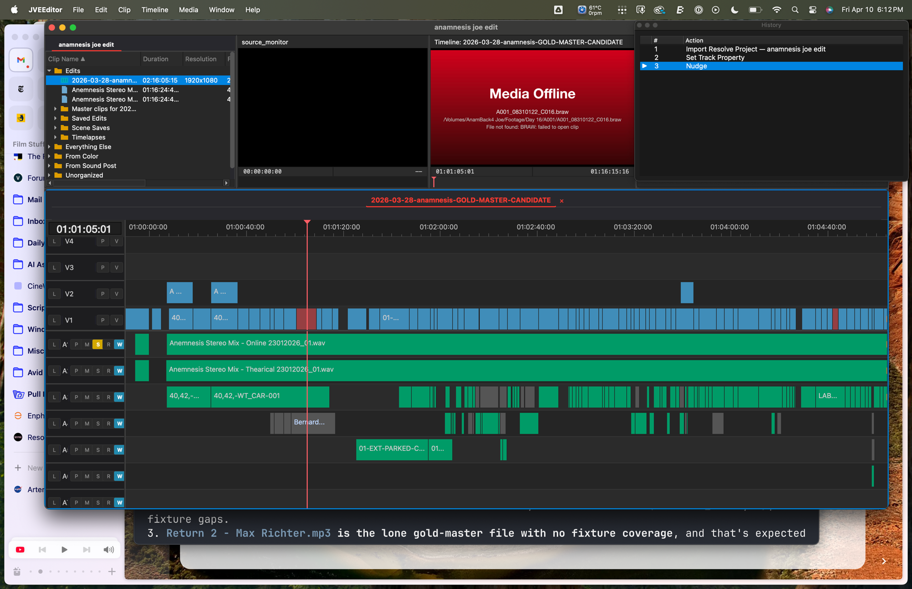
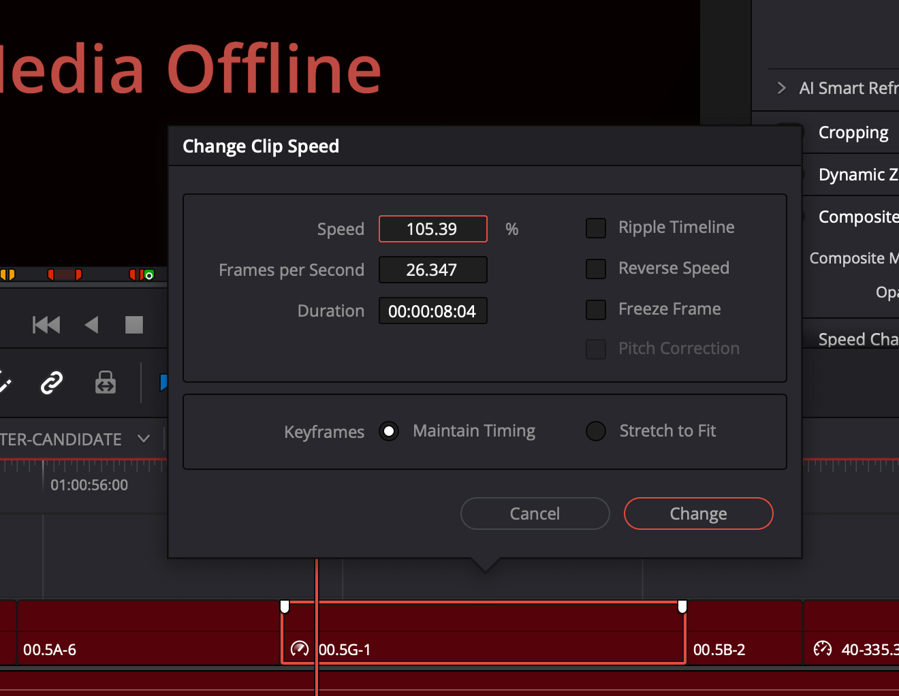

# DRP Retimed-Clip Importer Bug & Fix

> **Investigation date**: 2026-04-10
> **Originally framed as**: a Resolve trim-handoff bug ("Resolve generates
> trimmed media that doesn't contain enough source content for our clips")
> **Actually was**: a JVE DRP-importer bug that flattened variable-speed
> retime curves to a single scalar `YMax/XMax` ratio at import time, producing
> wrong `source_in_frame` for any retimed clip whose curve isn't a single
> straight line through the origin.
> **Status**: fixed in `src/lua/importers/drp_importer.lua`. Regression tests:
> `tests/test_drp_retime_curve_walk.lua` (parse-level) and
> `tests/test_e2e_retime_relink.lua` (end-to-end import → relink → assertion
> safety, run via `JVEEditor --test`).

## TL;DR

DRP timeline clips with a retime have a `<MediaTimemapBA>` blob describing the
master clip's playback curve as a list of `(X, Y)` keyframes (X = master
playback timeline seconds, Y = source seconds). The importer used to compute

    in_offset = floor(in_value × abs_speed + 0.5)

for retimed clips, where `abs_speed = YMax / XMax`. That's correct for a curve
that's a single straight line from `(0, 0)` to `(XMax, YMax)`, but wrong for
any curve with intermediate keyframes — especially curves that have an
**identity head segment** (the typical shape Resolve makes when the user
applies a speed change starting partway into the clip).

The fix walks the actual curve at the clip's `In` position:

    in_seconds  = in_value / frame_rate
    out_seconds = (in_value + duration_raw) / frame_rate
    y_in_sec    = eval_curve(keyframes, in_seconds)
    y_out_sec   = eval_curve(keyframes, out_seconds)
    in_offset       = ceil(y_in_sec  × frame_rate)
    source_duration = ceil(y_out_sec × frame_rate) − in_offset

For unretimed clips and constant-speed clips with two keyframes through the
origin, this collapses to the same value as the old formula. For variable
retimes (intermediate keyframes) and for constant retimes with non-identity
head segments, it produces the value Resolve actually means — verified by
re-importing the same clip with retiming removed in Resolve and observing
that the new `<In>` value equals what curve walking computes from the
retimed `<In>`.

## How the bug presented

In the user's project, the gold master sequence had clips that played as
"Media Offline" in JVE even though the fixture file was on disk and the
file's timecode metadata was correct:

The clip is at speed 105.39 % (variable retime). Here's Resolve's
Change Clip Speed dialog for the same clip:

Two clips in `2026-03-28-anamnesis-GOLD-MASTER-CANDIDATE` sat one frame off:

| clip      | speed     | timeline_start | duration | source_in (old)             | source_in (fixed)            |
|---|---|---|---|---|---|
| `00.5G-1` | 105.39 % (variable, identity head) | 91519 | 204 | 124710 (`01:23:08:10`)  | **124682 (`01:23:07:07`)** |
| `01-333-2`| 88 %      (constant slow-mo) | 92770 | 132 | 111915 (`01:14:36:15`)  | **111916 (`01:14:36:16`)** |

Both old values produced `file_frame = source_in − first_frame_tc < 0` when
the playback engine asked the trimmed-fixture file for the clip's first
source frame, and the C++ assertion at
`src/editor_media_platform/src/emp_timeline_media_buffer.cpp:740`

    JVE_ASSERT(file_frame >= 0,
        "GetVideoFrame: negative file_frame=" + ...);

fired and crashed the editor — visible in the saved terminal output as
~40 instances of `decode_into_cache: negative file_frame=-1 source=111915
first_frame_tc=111916`. The assertion is correct and stays in place; the
fix removes the conditions that trigger it.

## The DRP retime data model

A retimed timeline clip carries:

| field             | meaning                                                   |
|---|---|
| `<In>`            | offset into the master clip's **playback timeline**, in frames at clip rate. Looks like a source-frame offset for unretimed clips because the curve is identity. |
| `<Duration>`      | duration on the *project* timeline, in frames at clip rate. |
| `<MediaStartTime>`| absolute TC of master clip's first frame (seconds since midnight). |
| `<MediaTimemapBA>`| binary blob describing the retime curve. Two formats: a 9-byte short header for clips with no retime (no curve data), and a version-1 large blob carrying `YMax`, `XMax`, `LastValidYOffset`, and a `KeyframesBA` nested blob with the actual `(X, Y)` pairs. |

The curve is `Y = f(X)` where:

- `X` = master clip playback timeline seconds (the X axis of the curve)
- `Y` = source seconds (the Y axis)

For a unity-speed master clip, `f(X) = X`. For a constant slow-mo at 88 %,
`f(X) = 0.88 × X` (meaning 1 timeline second consumes 0.88 source seconds —
the source plays slower than real time). For a variable retime with an
identity head, `f(X) = X` for `X ≤ kf1.x`, then a different slope from
`kf1` to `kf2`, etc.

To convert a clip's `<In>` to a source-frame offset, you walk the curve at
`X = In_seconds` and read `Y_seconds`, then convert to frames at the clip
rate. The previous code took the shortcut of `In × (YMax / XMax)`, which
collapses the entire curve to its average slope and only happens to be
correct when the curve is a single straight line through the origin.

## Why the old formula was wrong for `00.5G-1`

The MTBA for `00.5G-1` has 4 keyframes (X = master timeline TC, Y = source TC):

| kf | X (timeline TC)   | Y (source TC)     | local slope |
|---:|---|---|---|
|  0 | `01:22:46:15`     | `01:22:46:15`     | —                            |
|  1 | `01:23:08:24`     | `01:23:08:24`     | **1.000 (identity)**         |
|  2 | `01:23:10:14`     | `01:23:11:08`     | 1.468                        |
|  3 | `01:23:22:07`     | `01:23:24:05`     | 1.100                        |

The clip's `In = 517` frames places it at master timeline TC `01:23:07:07`,
which lands in the **identity head segment** (kf0 → kf1). Walking the curve
gives `Y = 01:23:07:07` (source TC equals timeline TC in this segment), so
`source_in_offset = 517` source frames. With `media_tc_origin = 124165`
(`01:22:46:15`), `source_in = 124682`.

The old formula computed `in_offset = floor(517 × 1.0539 + 0.5) = 545`,
producing `source_in = 124710` — `28 frames` later than where the clip's
content actually starts. The 28-frame error is exactly `In × (avg_speed − 1)`
for a clip whose `In` lands in an identity segment.

## Why the old formula was *almost* right for `01-333-2`

`01-333-2` has only 2 keyframes (constant slow-mo, no identity head):

| kf | X (timeline TC) | Y (source TC) |
|---:|---|---|
|  0 | `01:14:20:22`   | `01:14:20:22` |
|  1 | `01:15:44:09`   | `01:15:33:24` |

Slope `(YMax / XMax) = 0.8799`. The clip's `In = 447` frames lands in the
single non-identity segment, so `Y_curve(447) = 447 × 0.8799 ≈ 393.27` —
which **rounds down** to `393` under `floor(x + 0.5)`.

The user verified Resolve's source viewer shows `01:14:36:16 = 393.something
≈ 394` for this clip. The fix uses **ceiling** rounding (`math.ceil`) for the
in-point, which is the convention Resolve uses: the in-point is the first
*valid* source frame ≥ the computed position, so we don't accidentally play
pre-clip content. With ceiling, both clips now match Resolve.

The constant-slope-through-origin case is the limit where `× scalar speed`
and `Y_curve(X)` produce the same answer (modulo the `floor` vs `ceil`
rounding direction). The bug is a generalization failure: assuming all
curves are that simple shape.

## The smoking-gun reproducer (`tests/fixtures/resolve/retime-test.drt`)

The user produced a minimal DRT containing two timeline clips that reference
the **same source content** of `A035_11200114_C056.mov`:

| field             | Clip 1 (retimed)     | Clip 2 (retiming removed) |
|---|---|---|
| `<In>`            | `447\|hex_speed`     | **`394`**                 |
| `<Duration>`      | 132                  | 132                       |
| `<MediaStartTime>`| 4460.88 (`01:14:20:22`) | 4460.88 (`01:14:20:22`)  |
| `<MediaTimemapBA>`| 660 bytes (full curve, slope 0.88) | **9 bytes** (no curve) |

When the retime is removed, Resolve recomputes `<In>` from `447` to `394` so
that the source content stays the same — `media_tc_origin + 394 = 111916 =
01:14:36:16`. That's the canonical source-frame offset for this clip's
in-point.

A correct importer must produce **`source_in_frame = 111916` for both clips**:

- Clip 1 (retimed): walk the curve. `Y_curve(447 frames at slope 0.88) =
  393.27 source frames`, ceiling to `394`. Add `media_tc_origin (111522)` →
  `111916`.
- Clip 2 (un-retimed): no curve. `In = 394` is already a source-frame offset.
  Add `media_tc_origin (111522)` → `111916`.

This is the regression test pinned in `tests/test_drp_retime_curve_walk.lua`:
both clips must produce the same `source_in_frame` after import. The old
broken code produces `111915` for clip 1 (one frame early) and `111916` for
clip 2 — a self-inconsistency between two representations of the same source
content.

## The fix in `drp_importer.lua`

Three pieces:

1. **`parse_keyframes(kf_bytes)`** (new) — decodes the `KeyframesBA` nested
   payload into an array of `{x, y}` pairs in seconds. The outer structure
   is `[BE32 version] [BE32 keyframe_count]`, then `kf_count` outer TLV
   fields (each named `"0"`, `"1"`, …, with `type = 0x000c` and a nested
   payload). Each inner payload is itself a TLV blob with fields `interp`,
   `YOut`, `YIn`, `Y`, `XOut`, `XIn`, `X`. We extract `X` and `Y` and
   discard the rest. `parse_inner_keyframe` handles one inner blob.

2. **`eval_curve(keyframes, x)`** (new) — piecewise-linear interpolation
   between sorted keyframes. Extrapolates from the first/last segment
   outside the keyframe range. Identity for unretimed clips (the curve
   degenerates to `Y = X` and there's nothing to do).

3. **`decode_media_timemap`** (extended) — now also returns the parsed
   keyframe list. Includes a sanity check: if the parsed keyframes don't
   match the parent `YMax` / `XMax` endpoints (some MTBA blobs store
   tangent-only data with all-zero anchors), discard the keyframes and let
   the importer fall back to a synthesized constant-speed curve.

4. **`parse_resolve_tracks`** (the consumer) — replaces the old `× speed`
   shortcut with curve walking. When MTBA keyframes are present, walks
   them. When only a hex-speed annotation is present (synthetic test data
   with `<In>NN|hex_speed</In>` and no MTBA), synthesizes a 2-point
   constant-speed curve from `(0, 0)` to `(∞, ∞ × speed)`. When neither is
   present, the clip is treated as un-retimed and `in_offset = in_value`.

The retimed-video and audio branches now share the same in-offset
computation; the audio branch additionally rescales source units to 48 kHz
samples.

## Tests

- **`tests/test_drp_retime_curve_walk.lua`** — pure-Lua parse test. Loads
  the `retime-test.drt` fixture's two clips inline (XML built with the
  exact hex blobs from the fixture file) and asserts both produce
  `source_in_frame = 111916`. Cross-checks: same source_in for both clips,
  retimed clip's source length ≈ 116 frames (`132 × 0.88`), un-retimed
  clip's source length = 132. Fast, runs in `luajit` directly via
  `tests/test_harness.lua`.

- **`tests/test_drp_retimed_clip_speed.lua`** — pre-existing test, updated.
  Test 8 (clip `01-333-2` from the real DRP) now expects `source_in =
  111916` (was `111915` under the old broken code). Tests 1, 4 (synthetic
  hex-speed) keep their numbers because the curve synthesis from
  `hex_speed` reproduces `× speed` for constant-speed clips through the
  origin. Tests 5, 6, 7 (no-retime variants) unchanged.

- **`tests/test_e2e_retime_relink.lua`** (new) — end-to-end test. Drives
  `JVEEditor --test` to (1) convert the real production DRP to a fresh
  `.jvp`, (2) verify the in-DB `source_in_frame` for both retimed clips
  matches the expected values, (3) build `media_infos` and run
  `media_relinker.relink_media_batch` against the fixture tree,
  (4) dispatch `RelinkClips` to commit, (5) verify both clips' media
  `file_path` now lives under `tests/fixtures/`, (6) probe the linked
  fixture file's `timecode` and confirm `source_in − first_frame_tc ≥ 0`
  — the exact condition the C++ assertion checks. Requires `--test` mode
  for `qt_xml_parse`.

## Coordinate-system reference

Three coordinate spaces are involved and they're easy to confuse:

| space                 | unit                          | example                              |
|---|---|---|
| sequence timeline     | frames at sequence rate       | `timeline_start_frame = 91519`       |
| master clip timeline  | frames at clip rate, X axis of MTBA curve | `In = 517` frames into master playback |
| source                | frames at file's native rate, Y axis of MTBA curve | `source_in_frame = 124682` |

`source_in_frame` is stored as **absolute TC at clip rate**: it's
`media_tc_origin + curve.Y(In)`, where `media_tc_origin = floor(MediaStartTime
× clip_rate + 0.5)`. The C++ playback engine converts to a file-relative
offset by subtracting `first_frame_tc` (the file's own TC origin probed from
its container).

## What this fix does NOT address

- **The wider relink flow** for clips that don't have MTBA data and have
  garbage `hex_speed` values (already handled by the existing "implausibly
  low → reset to 1.0" guard).
- **HOSPITAL_WT-T001.WAV's audio in-point**, which is a 1-frame off-by-one
  in the BWF audio path. The user observed it presents the same way ("source
  TC is wrong by exactly one frame") but the audio code path doesn't go
  through the curve walker — its `× audio_speed` path is structurally similar
  but operates in samples, not frames. The audio fix is deferred and tracked
  separately.
- **Bezier-interpolated retime curves**. The `interp`, `XIn`, `XOut`,
  `YIn`, `YOut` fields in each keyframe define Bezier tangent vectors that
  could shape the curve between anchors. For the clips we've seen (`00.5G-1`,
  `01-333-2`), these are all zero and linear interpolation matches Resolve.
  If we encounter a clip with non-zero tangents, `eval_curve` will need a
  Bezier mode.
- **Reverse playback** (negative slope). `detect_reverse_from_keyframes`
  in the importer already checks the keyframe slope sign and sets
  `is_reverse`; the curve walker handles reverse correctly because the
  slope encoding is preserved by sorting keyframes by `X` ascending.
